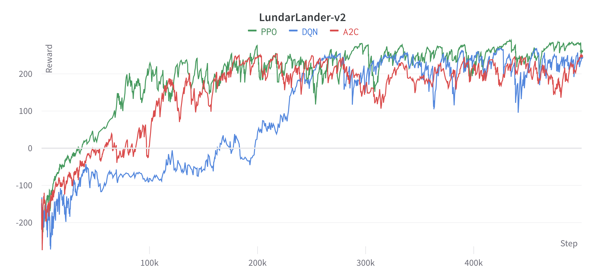
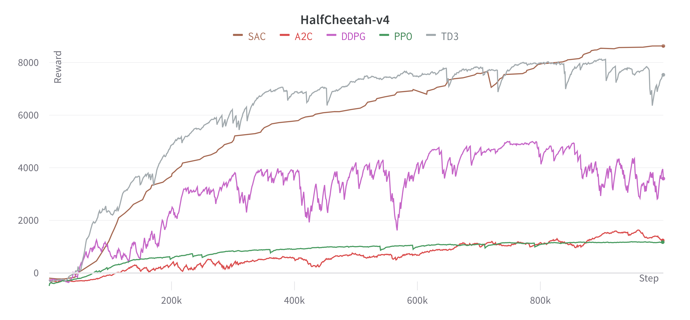

# rl-gym-zoo

[](https://opensource.org/licenses/MIT)
[](https://github.com/psf/black)
[](https://pycqa.github.io/isort/)
[](https://www.codefactor.io/repository/github/valentin-cnt/rl-gym-zoo)

This repository aims to implement various popular RL algorithms and evaluate their performance using the [Gymnasium](https://github.com/Farama-Foundation/Gymnasium) framework.
It is developed using [Pytorch](https://github.com/pytorch/pytorch) in Python language and supports all Gymnasium environments, including MuJoCo and Atari.

This project is greatly inspired by [CleanRL](https://github.com/vwxyzjn/cleanrl). I highly recommend you to check it out if you are looking for a more complete and well documented RL library.

| RL Algorithm                                           | Pytorch                                                                                                                                                                                                                                                                               | Flax |
|--------------------------------------------------------|---------------------------------------------------------------------------------------------------------------------------------------------------------------------------------------------------------------------------------------------------------------------------------------|------|
| [DQN](https://arxiv.org/abs/1312.5602)                 | [dqn](https://github.com/valentin-cnt/rl-gym-zoo/blob/master/src/dqn/dqn.py) - [dqn_atari](https://github.com/valentin-cnt/rl-gym-zoo/blob/master/src/dqn/dqn_atari.py)                                                                                                         |      |
| [A2C](https://arxiv.org/abs/1602.01783)                | [a2c](https://github.com/valentin-cnt/rl-gym-zoo/blob/master/src/a2c/a2c.py) - [a2c_continuous](https://github.com/valentin-cnt/rl-gym-zoo/blob/master/src/a2c/a2c_continuous.py) - [a2c_atari](https://github.com/valentin-cnt/rl-gym-zoo/blob/master/src/a2c/a2c_atari.py) |  [a2c](https://github.com/valentin-cnt/rl-gym-zoo/blob/master/src/a2c/a2c_flax.py) - [a2c_atari](https://github.com/valentin-cnt/rl-gym-zoo/blob/master/src/a2c/a2c_atari_flax.py)    |
| [PPO](https://arxiv.org/abs/1707.06347)                | [ppo](https://github.com/valentin-cnt/rl-gym-zoo/blob/master/src/ppo/ppo.py) - [ppo_continuous](https://github.com/valentin-cnt/rl-gym-zoo/blob/master/src/ppo/ppo_continuous.py) - [ppo_atari](https://github.com/valentin-cnt/rl-gym-zoo/blob/master/src/ppo/ppo_atari.py) |      |
| [DDPG](https://proceedings.mlr.press/v32/silver14.pdf) | [ddpg](https://github.com/valentin-cnt/rl-gym-zoo/blob/master/src/ddpg/ddpg.py)                                                                                                                                                                                                    |      |
| [TD3](https://arxiv.org/abs/1802.09477)                | [td3](https://github.com/valentin-cnt/rl-gym-zoo/blob/master/src/td3/td3.py)                                                                                                                                                                                                       |      |
| [SAC](https://arxiv.org/abs/1801.01290)                | [sac](https://github.com/valentin-cnt/rl-gym-zoo/blob/master/src/sac/sac.py)                                                                                                                                                                                                       |      |

## Prerequisites

- poetry >= 1.3.0
- python >= 3.10, < 3.11

## Installation

Clone the code repo and install the requirements.

```shell
git clone https://github.com/valentin-cnt/rl-gym-zoo.git
cd rl-gym-zoo

poetry env use 3.10
poetry update
```

⚠️ **Important**: The package `box2d-py` doesn't install properly with poetry.

You should run `pip install box2d-py==2.3.5` before `poetry update` to make sure everything install correctly.

## Usage

```shell
poetry shell

# DQN
python src/dqn/dqn.py
python src/dqn/dqn_atari.py

# A2C
python src/a2c/a2c.py
python src/a2c/a2c_continuous.py
python src/a2c/a2c_atari.py

# PPO
python src/ppo/ppo.py
python src/ppo/ppo_continuous.py
python src/ppo/ppo_atari.py

# DDPG
python src/ddpg/ddpg.py

# TD3
python src/td3/td3.py

# SAC
python src/sac/sac.py
```

To view logs on Tensorboard:

```shell
poetry run tensorboard --logdir=runs
```

## Results

### LunarLander-v2



### HalfChetaah-v4


